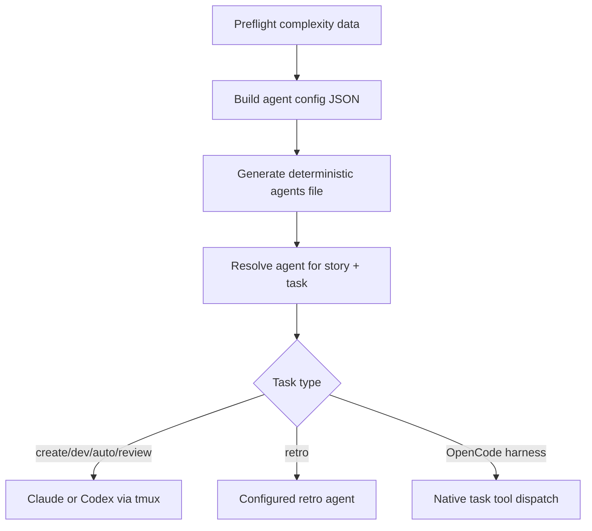
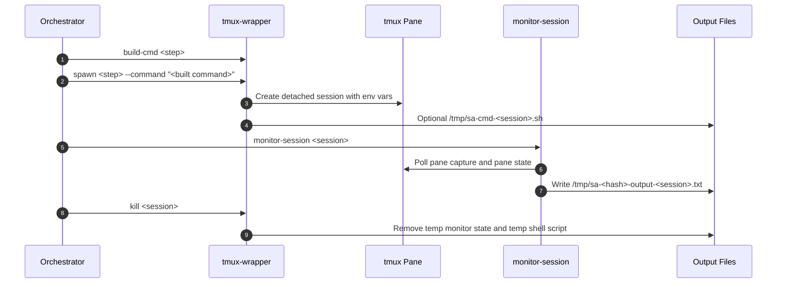
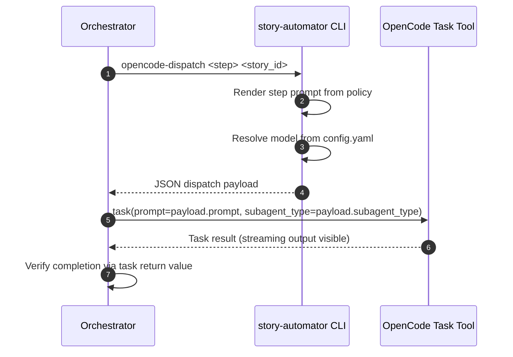
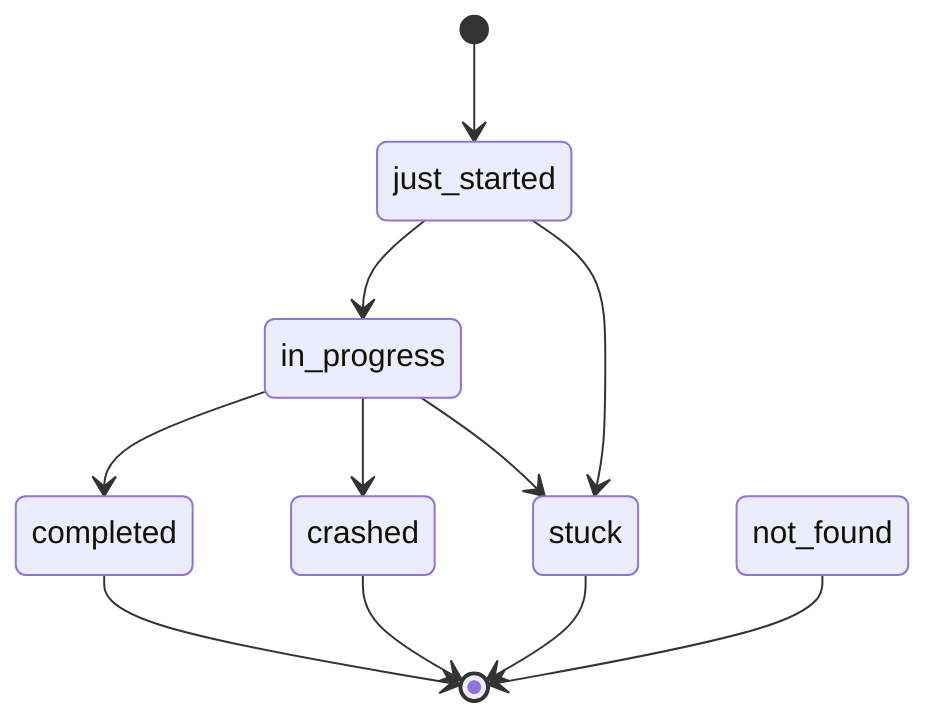
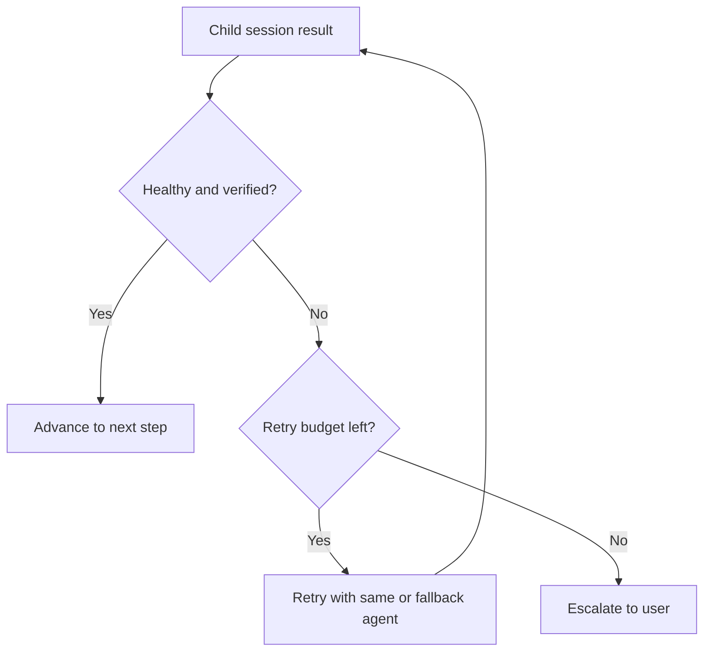

# Agents And Monitoring

This doc explains how Story Automator chooses child agents, builds child-session commands, and decides whether a session is active, completed, stuck, or incomplete.

## Agent Model

There are three distinct agent layers:

- the orchestrator itself, which runs from a supported top-level agent session
- child sessions, which run Claude or Codex via tmux (for those harnesses) or OpenCode via native task dispatch
- OpenCode harness uses native task tool dispatch — no tmux, no heartbeat polling

Agent selection is driven by:

- default primary and fallback values
- per-task overrides
- complexity-based overrides
- retro-specific rule: retrospective uses the configured retro agent
- harness type: determines whether child sessions are spawned via tmux or native task tool

## Harness Detection

The automator detects the active harness by checking the project root for harness-specific directories and markers:

| Harness | Detection Method |
|---------|-----------------|
| Claude | `.claude/` directory exists |
| Codex | `.codex/` directory exists |
| OpenCode | `.opencode/` directory exists |

When multiple harnesses are detected, the priority order is: OpenCode > Codex > Claude. The `BMM_AGENT` environment variable can override this.

## Agent Resolution



The generated agents file is a runtime artifact, not just display text.

## Child-Session Command Build

### Claude and Codex (tmux-based)

The helper CLI generates step-specific commands with `tmux-wrapper build-cmd`.

Examples:

- `create`
- `dev`
- `auto`
- `review`
- `retro`

Important behavior:

- child sessions are always spawned through `tmux-wrapper spawn`
- `--command` is mandatory
- long commands are written to `/tmp/sa-cmd-<session>.sh`
- review and retro prompts are assembled from resolved sibling skill/workflow files

### OpenCode (native task tool)

When OpenCode is detected as the harness, the automator generates a JSON dispatch payload instead of a tmux command.

The orchestrating OpenCode agent reads this payload and calls its native `task` tool with the rendered prompt.

Example dispatch payload:

```json
{
    "dispatch": "opencode_task",
    "step": "dev",
    "storyId": "1.2",
    "prompt": "... rendered step prompt ...",
    "model": "gpt-4o",
    "subagent_type": "coder"
}
```

Key differences from tmux-based harnesses:

- no tmux session is spawned
- no heartbeat polling — tasks are fire-and-forget
- no output capture files — progress is visible in the task tool's streaming output
- completion is detected via the task tool's return value
- stop hooks are not installed — OpenCode uses native lifecycle (session.idle / process teardown)

## tmux Lifecycle (Claude and Codex)

This lifecycle applies only to Claude and Codex child sessions. OpenCode uses native dispatch (see above).



Environment details:

- `STORY_AUTOMATOR_CHILD=true`
- `AI_AGENT=<claude|codex>`
- Codex child sessions use isolated `CODEX_HOME` under `/tmp`

## OpenCode Native Lifecycle

OpenCode tasks are fire-and-forget. The automator generates a dispatch payload, and the orchestrating agent passes it to the native task tool.



Important characteristics:

- no tmux session is created
- no heartbeat polling — the task tool handles lifecycle
- no output capture files — output streams through the task tool
- no stop hooks are installed — OpenCode manages process teardown
- the automator cannot kill or signal an OpenCode task — it must complete or fail on its own

## OpenCode Model Configuration

OpenCode supports per-step model overrides via `_bmad/bmm/config.yaml`:

```yaml
opencode:
  models:
    orchestrator: ""      # global default (empty = opencode default)
    create: ""            # model for create-story step
    dev: ""               # model for dev-story step
    auto: ""              # model for qa-generate-e2e-tests step
    review: ""            # model for code-review step
    retro: ""             # model for retrospective step
  subagent_type: "coder"  # default subagent type for task tool
```

Model resolution order:

1. `--model` CLI flag (explicit override)
2. `opencode.models.<step>` from config.yaml
3. Empty string = OpenCode uses its default model

If the config block is absent or all values are empty, OpenCode uses whatever model is configured in its own settings.

## Claude vs Codex

Python Story Automator does support Codex child sessions.

That is a major difference from the older Go README guidance.

Important Codex-specific behavior:

- Codex child sessions use isolated `CODEX_HOME`
- auth is symlinked into that temp home
- plugins, sqlite, and shell-snapshot are disabled for quieter child startups
- approval policy is set to `never`
- high reasoning is kept for child sessions

## Monitoring States

### Claude and Codex

`monitor-session` polls helper status and collapses it into a small set of orchestration outcomes.



Important distinctions:

- `completed` means the CLI exited or verification passed
- `in_progress` means the child still looks alive or recently active
- `stuck` means no valid progress signal within the allowed window
- `incomplete` is a review-specific result, not a generic session state

### OpenCode

OpenCode tasks do not use tmux monitoring. The orchestrating agent tracks completion via:

- the task tool's return value (success/failure)
- the task tool's streaming output (visible in real time)
- verification of sprint status or story file after task completion

There is no heartbeat, no pane capture, and no crash recovery with auto-retry. If an OpenCode task fails, the orchestrating agent must decide whether to retry or escalate.

## Review Verification

Review sessions add extra verification:

- pass `--workflow review --story-key <story>`
- verify sprint status or story-file status before accepting completion

This is what prevents false positives where a review session exits but the story was never marked done.

This applies to both tmux-based (Claude/Codex) and native (OpenCode) review tasks. The verification step is the same — only the dispatch mechanism differs.

## Output Files And Scratch Data

### Claude and Codex

During monitoring, the runtime may write:

- `/tmp/sa-<hash>-output-<session>.txt`
- `/tmp/.sa-<hash>-session-<session>-state.json`
- `/tmp/sa-cmd-<session>.sh`

These are runtime scratch files. They are cleaned on normal session kill.

### OpenCode

OpenCode tasks do not produce tmux scratch files. Output is captured via the task tool's return value. The dispatch payload is ephemeral — it is read by the orchestrating agent and not persisted.

## Retry And Escalation



Escalation is intentionally the last step, not the first response.

For OpenCode, retry logic is simpler — there is no tmux session to kill and respawn. The orchestrating agent re-dispatches via the task tool with the same or modified prompt.

## Practical Operator Notes

- if a child session looks done but review verification fails, treat it as incomplete, not complete
- if a long command is involved, the child may be running through a temp shell script rather than directly
- if monitor output is suspicious, re-check tmux and sprint-status directly
- OpenCode tasks are fire-and-forget — if a task appears stuck, check the task tool output, not tmux
- OpenCode cannot be killed by the automator — if a task hangs, the user must intervene at the OpenCode level

## Read Next

- [Review Workflow](./review-workflow.md)
- [Troubleshooting](./troubleshooting.md)
